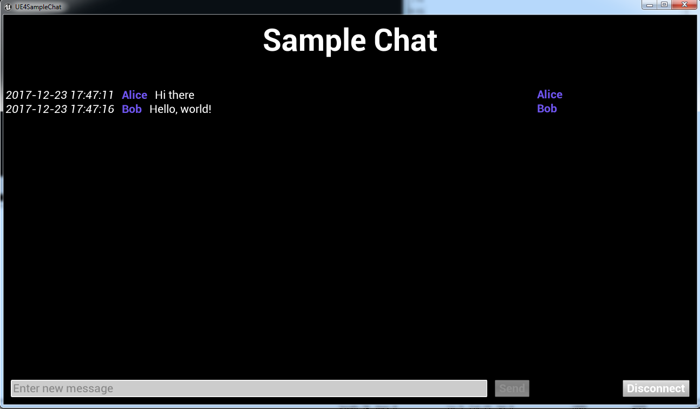
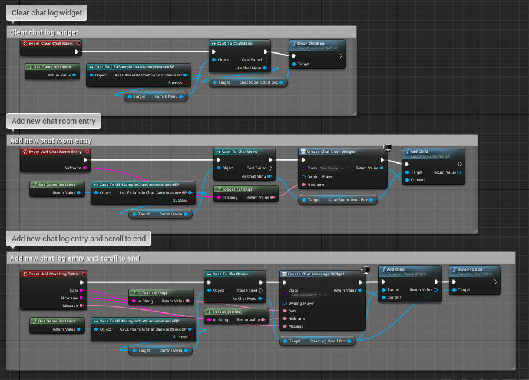

# UE4SampleChat

Unreal Engine 4 sample chat application.

## Description

_UE4SampleChat_ is a demo program made using Unreal Engine. Writing chat with UE4 is not a good idea but it's a good way to practice with it.
All work with network subsystem is written in code, blueprints are used only for interface (you can check them in [Docs](Docs/) directory).

## Building

Built with Unreal Engine 4.17.2 using Microsoft Visual Studio Community 2017 (but 2015 should be enough).

## Installation

Not required.

## Usage

To test chat just launch two local copies: one as host and other one as client (join process takes several seconds).
Send couple messages.
